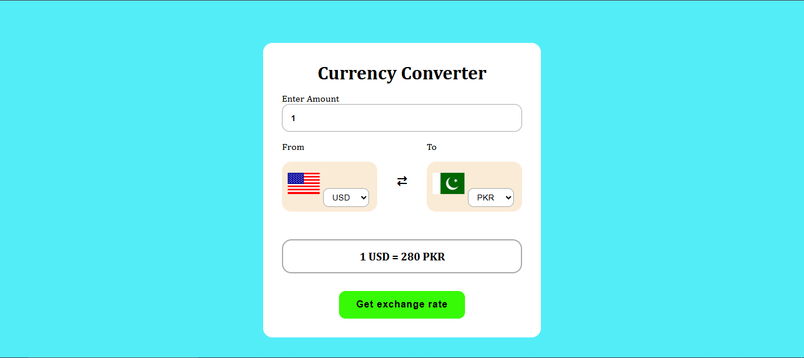
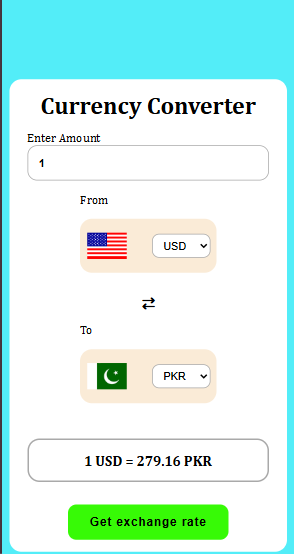

# 💱 Currency Converter Web App

  <table border="0" style="background: #1f2937; border-radius: 16px; padding: 35px; border-collapse: separate; border-spacing: 30px 0;">
    <tr>
      <td align="center" valign="middle">
        
         
        <b style="color: #e5e7eb; font-family: sans-serif; font-size: 15px;">Main View (Desktop)</b>
      </td>
      
  <td align="center" valign="middle">
        
         
        <b style="color: #e5e7eb; font-family: sans-serif; font-size: 15px;">Mobile View</b>
  </td>
  </tr>
  </table>

A modern currency conversion tool built with **HTML5, CSS3, and vanilla JavaScript**. This application delivers reliable international currency exchange calculations using live rate data and a polished responsive interface.

## 🚀 Live Demo

## 📌 Project Overview
- Real-time foreign exchange calculation using **ExchangeRate-API**.
- Supports over **160 currencies** with country flags for visual clarity.
- Mobile-first responsive design for desktop, tablet, and smartphone users.
- Input validation and error handling for accurate conversions.

## 🔍 SEO Keywords
currency converter, exchange rate calculator, foreign exchange tool, real-time currency rates, travel money calculator, international payments.

## ✨ Key Features
- **Live Rates:** Fetches up-to-date currency data from a trusted API.
- **Currency Flags:** Displays flags alongside currency codes for fast recognition.
- **Smooth UX:** Clean layout, intuitive form controls, and fast conversion response.
- **Responsive Layout:** Works seamlessly across all screen sizes.

## 🔧 Technologies Used
- **HTML**: Structures the converter interface and form elements.
- **CSS**: Delivers a modern, responsive layout with smooth styling and media queries.
- **JavaScript**: Handles API integration, dynamic dropdown population, and conversion logic.
- **Font Awesome**: Provides icons for enhanced UI elements.
- **FlagsAPI**: Supplies country flag images for visual currency representation.

## 🚀 Getting Started
1. Clone the repository.
2. Open `index.html` in a web browser, or use a local server for full functionality.

## 💻 How to Use
Open the live demo link above to explore the currency converter, or run the files locally with any static server for testing.

