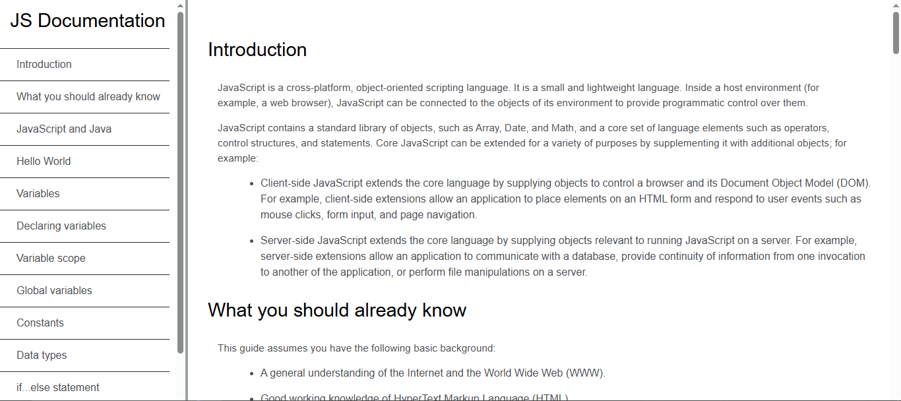
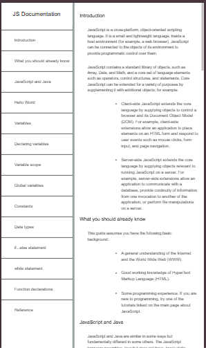

# 📚 JS Documentation Page

  
  

A clean, responsive technical documentation website built with **HTML5 and CSS3**. This project is designed to showcase developer documentation patterns, code-friendly layout, and accessible navigation for knowledge-sharing platforms.

## 🚀 Live Demo

## 📌 Project Overview
This documentation page replicates the structure of modern developer docs and is ideal for API references, learning platforms, and product knowledge bases.

## 🔍 SEO Keywords
technical documentation site, developer docs template, responsive documentation layout, HTML CSS documentation, code reference page.

## ✨ Key Features
- **Fixed sidebar navigation** for fast access to sections.
- **Readable code styling** for `<pre>` and `<code>` blocks.
- **Responsive layout** that adapts the sidebar into a mobile-first view.
- **Structured content flow** for easy scanning and learning.

## 🔧 Technologies Used
*   **Structure:** HTML5
*   **Styling:** CSS3 (Media Queries, Position: Fixed)

## � Getting Started
1. Clone the repository.
2. Open `index.html` in a web browser to view the documentation.

## �💻 How to Use
Navigate through the sections using the sidebar on the Live Site.
