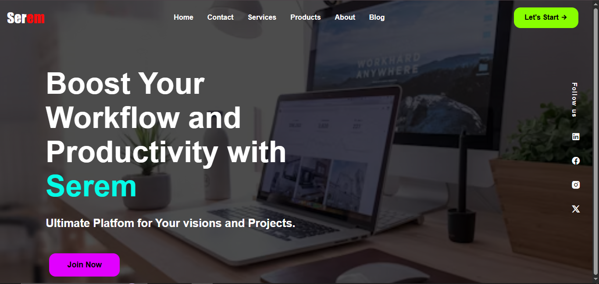

# ✨ Serem Landing Page

  
  

A high-conversion responsive landing page designed for modern product launches, SaaS offerings, and marketing campaigns. This project combines strong visual hierarchy with polished UI design.

## 🚀 Live Demo

## 📌 Project Overview
Serem is a marketing-focused landing page built to capture attention and encourage action through clear content sections and strategic CTAs.

## 🔍 SEO Keywords
landing page design, marketing website, responsive landing page, CTA optimization, startup landing page, SaaS landing page.

## ✨ Key Features
- **Hero section** that communicates value immediately.
- **Card-based content** and structured copy for easy scanning.
- **Responsive typography** across devices.
- **Grid and Flexbox layout** for polished alignment.

## 🔧 Technologies Used
*   **Structure:** HTML5
*   **Styling:** CSS3

## � Getting Started
1. Clone the repository.
2. Open `index.html` in a web browser to view the landing page.

## �💻 How to Use
Simply visit the Live Link to experience the design.
